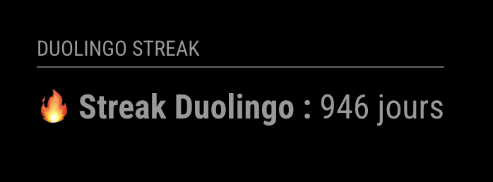

# MMM-Duolingo-Streak

A simple MagicMirror² module that displays your **Duolingo streak** directly on your smart mirror.

🔥 Know at a glance whether you’ve done your daily lesson — or if your streak is freezing over 🥶!

## ✨ Preview




## 📦 Installation

Open a terminal on your MagicMirror device and run:

```bash
cd ~/MagicMirror/modules
git clone https://github.com/thomaspich/MMM-Duolingo-Streak.git
```

## 🔄 Update

To update the module:

```
cd ~/MagicMirror/modules/MMM-Duolingo-Streak
git pull
```

## ⚙️ Configuration

Add the following to your config/config.js:

```
{
  module: 'MMM-Duolingo-Streak',
  position: 'top_left', // Or wherever you like
  config: {
    username: 'ThomasPichard', // Your Duolingo username
    updateInterval: 5 // Update interval in minutes (default: 5)
  }
}
```

## 🛠️ Configuration Options

|Option|	Type|	Default|	Description|
|-|-|-|-|
|username|	string|	“”|	Your Duolingo username|
|updateInterval|	int|	5|	Update frequency in minutes|


## 💡 Features
- Fetches data from API in realtime
- Displays your current streak
- Shows 🔥 if your lesson is done today, 🥶 if not


## 🧪 Example Output

🔥 Duolingo Streak: 42 days
or
🥶 Duolingo Streak: 42 days (if you haven’t completed your lesson yet)

## 👤 Author

Make with ❤️ by [@thomaspich](https://github.com/thomaspich)

Forked from [@Dennis-Rosenbaum](https://github.com/Dennis-Rosenbaum/MMM-Template)


## 📚 Resources
- [MagicMirror² Documentation](https://docs.magicmirror.builders)
- [MagicMirror Forum](https://forum.magicmirror.builders)